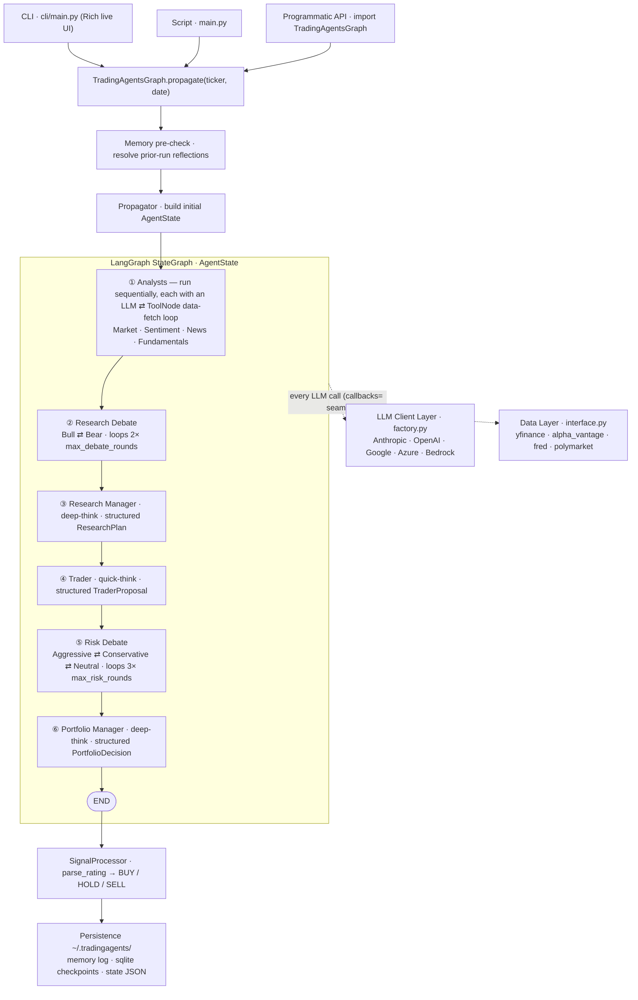
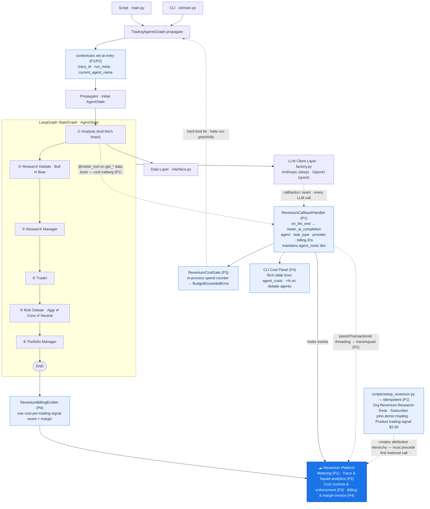

# TradingAgents × Revenium — Architecture Diagrams

**Purpose:** A comprehension aid for the project owner (limited prior TradingAgents experience) and a communication artifact for the Fidelity FCAT conversation. Two views:

1. **TradingAgents only** — the multi-agent pipeline as it exists today, Revenium-agnostic.
2. **TradingAgents + Revenium (final state)** — the same pipeline annotated with every Revenium integration point assuming all four pillars are implemented.

Both diagrams are validated Mermaid (`flowchart`). Paste into any Mermaid renderer (mermaid.live, GitHub, VS Code Mermaid preview) to view.

> Sourced from `.planning/codebase/ARCHITECTURE.md` (graph topology) and `.planning/research/` (Revenium integration plan). Phase tags `(P1)–(P4)` map to ROADMAP.md phases.

---

## Diagram 1 — TradingAgents pipeline (Revenium-agnostic)

The core loop: entry point → build state → run the LangGraph `StateGraph` (analysts → two debate loops with a manager/trader between them → portfolio manager) → extract a BUY/HOLD/SELL signal. Every agent node calls an LLM through one client layer; analysts also fetch data through one vendor-routing layer. The **two debate loops** (Bull⇄Bear, Aggressive⇄Conservative⇄Neutral) are where the LLM-call volume — and therefore the cost — concentrates.

**Reading notes for FCAT:**
- It's a single compiled LangGraph `StateGraph`; agents are closures `(state) -> state-delta`, wired with conditional loop-back edges for the debates.
- "Deep-think" agents (Research Manager, Portfolio Manager) and "quick-think" agents (analysts, Trader) are two configurable model tiers — the seam where multi-provider routing happens.
- The framework already passes a `callbacks=` list to every LLM (today: a token/usage stats handler). **That one seam is where Revenium attaches.**

---

## Diagram 2 — TradingAgents + Revenium integration (final state)

Same pipeline (collapsed for clarity), now showing every Revenium touchpoint. Blue nodes are net-new Revenium components; the solid blue node is the Revenium SaaS platform. Nothing in the trading topology changes — instrumentation is additive via the existing `callbacks=` seam and `contextvars`.

### Integration point legend (maps to the four pillars)

| # | Component | Pillar / Phase | What it does |
|---|-----------|----------------|--------------|
| Pre | `scripts/setup_revenium.py` | Foundation (P1) | Idempotently creates Org → Subscriber → Product → Subscription. **Attribution is not retroactive** — runs before the first metered call. |
| 1 | `contextvars` (trace_id, agent name, run meta) | Meter/Trace (P1→P2) | Carries per-call identity across the whole graph with no `AgentState` or topology changes (one-line set per agent node). |
| 2 | `ReveniumCallbackHandler` | **Meter (P1)** | Hooks the existing `callbacks=` seam; on every `on_llm_end` fires a metered event tagged with agent, `task_type`, provider, and billing IDs; keeps a live `agent_costs` dict. |
| 3 | `@meter_tool` on data-fetch tools | **Meter (P1)** | Meters analyst `get_*` data calls so tool cost vs. token cost (the "cost iceberg") is visible. Sentiment `.func` bypass is the one documented exemption. |
| 4 | `parentTransactionId` threading | **Trace (P2)** | Turns the flat span list into a dependency tree / squad so the debate loops surface as the visual cost hotspot. |
| 5 | `ReveniumCostGate` | **Control (P3)** | In-process spend counter raises `BudgetExceededError` in real time (no server round-trip latency); `propagate()` catches it and halts the run gracefully on stage. |
| 6 | CLI Cost Panel | Control surface (P4) | Rich table reading `agent_costs`, `×N` on debate agents — cost visible in-app, not only in Revenium. |
| 7 | `ReveniumBillingEmitter` | **Monetize (P4)** | After a successful run, emits one "cost per trading signal" billing event with margin → priced invoice in Revenium's Costs & Revenue view. |
| ☁ | Revenium Platform | All four | The SaaS surface where metering, trace/squad analytics, enforcement events, and billing/margin all land. |

**The demo arc** reads left-to-right across the blue nodes: **meter** (2,3) → **trace** (4) → **control** (5,6) → **monetize** (7) — one live ticker run.

---

*Generated: 2026-06-27 · Phase 1 discussion. Diagrams validated via Mermaid renderer.*
